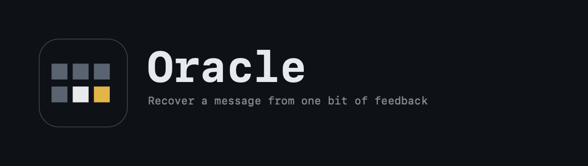

<div align="center">

<picture>
  <source media="(prefers-color-scheme: dark)" srcset=".github/assets/lockup-dark.png">
  <source media="(prefers-color-scheme: light)" srcset=".github/assets/lockup-light.png">
  
</picture>

**Recover a message from one bit of feedback.**

[**Open the demonstration →**](https://andifathulms.github.io/oracle/)

[](https://github.com/andifathulms/oracle/actions/workflows/deploy.yml)
&nbsp;

&nbsp;


</div>

---

You are given a ciphertext and no key. You are given a server that will tell you
exactly one thing about any ciphertext you send it: whether its PKCS7 padding was
valid. One bit.

From that one bit, repeated, Oracle recovers the entire plaintext, byte by byte,
without ever attacking the cipher.

**The AES is never broken. The padding check is the entire hole.**

## The mechanism

CBC decrypts each block as `Pᵢ = Dₖ(Cᵢ) ⊕ Cᵢ₋₁`. The intermediate block `Dₖ(Cᵢ)`
is sealed by the key and never learned. But `Cᵢ₋₁` is just bytes, and the attacker
sends them, so the attacker controls the plaintext the server checks:

```
P_seen = intermediate ⊕ C_crafted
```

Sweep a byte until the oracle accepts, and the padding value it must have hit
gives you that byte of the intermediate. XOR with the real previous block and you
have the plaintext. No key, at any point.

## What it shows

| | |
|---|---|
| **The stack** | Four aligned rows of byte-cells: what was sent, what the oracle judged, what it revealed, what it means. The intermediate row starts as genuine void and fills with gold, right to left. |
| **The sweep** | The inner loop. 255 near-silent rejections, one accept, one bit each. |
| **The disambiguation** | The honest beat. On a last-byte hit the attack perturbs byte 14 and re-queries, catching the false positive a plaintext ending in `0x02` would otherwise cause. Most visualisations skip it — **you can switch it off and watch the recovery stall.** |
| **The cipher's irrelevance** | Switch between real AES-128 and a toy permutation. Same recovery, same cost, both counts on screen. |
| **The silence** | Turn on encrypt-then-MAC. The tag is checked before anything is decrypted, every reply becomes identical, and the sweep starves. No gold ever appears. |
| **Bit-flipping** | The same CBC malleability, seen as tampering rather than recovery. |

## Integrity

**The view never receives the key or the plaintext.** `src/engine/secret.ts` holds
them in a closure and exposes only an `AttackTarget`: ciphertext, IV, oracle, call
count. Everything on screen came from the attack, not from a value the app already
held. Enforced by types and by `tests/view-blindness.test.ts`, which runs the
attack against a plaintext held in the test's own closure and asserts the screen
reaches the same answer.

**The oracle returns one boolean.** No error detail, no timing, no position. The
attack has to work from one bit because that is the truth of the attack.

**The app has no network code at all.** A test greps the built bundle for `fetch`,
`XMLHttpRequest`, `WebSocket` and `sendBeacon` and fails on any hit. Its inability
to reach a real server is a property of the build, not a promise.

## Develop

```bash
npm install
npm run dev        # Vite dev server
npm test           # attack, disambiguation, CBC/PKCS7, MAC, no-network, blindness
npm run build      # typecheck + production build
npm run lint
```

The engine (`src/engine/`) is pure: no React, no DOM, no `Date`. The attack runs
once, up front, producing a trace; the UI replays it at the chosen speed, so
scrubbing costs nothing. Sessions are seeded, so a URL reproduces a specific
message and its recovery exactly.

## Deploy

GitHub Pages via Actions: typecheck → lint → test → no-network grep → build,
deploying only on green. Enable under **Settings → Pages → Source: GitHub Actions**.

## Reference

| File | |
|---|---|
| [`PRD.md`](PRD.md) | What and why. §2 is the exact mechanism the engine implements. |
| [`DESIGN.md`](DESIGN.md) | How it looks and moves. |
| [`CLAUDE.md`](CLAUDE.md) | Build instructions and non-negotiables. |

Brand export masters live outside the repo in `exports/` (gitignored). The assets
the app serves are vendored into [`public/`](public/); re-export there, then copy
forward what changed.
